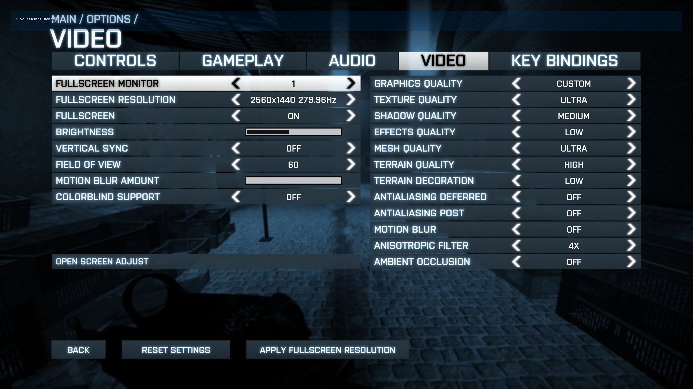

# Battlefield 3 UI Scaling Fix
A fork of [GlacierLab's](github.com/GlacierLab/bf3_fix) BF3 UI scaling fix, with additional fixes for flickering text and flag capture icon not progressing. Scales the UI at higher resolutions to match the 720P size HUD.

Optional godmode revive bug fix from [FlashHit](https://github.com/FlashHit) - Fixes the ["crabwalk" bug](https://www.youtube.com/watch?v=S9q62Ii3ObM) which occasionally happens from many consecutive revives, fixes [chat lag](https://www.youtube.com/watch?v=NSkG4IXkPHY) (200+ messages recieved by the player's client causes severe FPS drops for every additional message), fixes [enemy players becoming unkillable](https://www.youtube.com/watch?v=vm98Y7Ee1A0) with anything other than a defibrillator after many consecutive revives.

## How to use
1. Download the `Engine.BuildInfo_Win32_Retail_dll` and optionally `gm_fix.dll` from [Releases](https://github.com/IlIHydraIlI/BF3-UI-Scaling-Fix/releases)
2. Rename `Engine.BuildInfo_Win32_Retail_dll` in your BF3 game folder to `ori_Engine.BuildInfo_Win32_Retail_dll`  
3. Put new `Engine.BuildInfo_Win32_Retail_dll` and optionally `gm_fix.dll` in BF3 game folder  
4. Launch game as normal  

## Build environment
Visual Studio 2022 with C++ workload installed  

## Note
I have used these fixes extensively in a multiplayer environment, should cause no issues related to punkbuster/anticheat. 

## Known Issues
- Killfeed sometimes freezes. Can be fixed by tabbing out and back into the game.
- The top and bottom "rows" of the commorose cannot be used. I'm not sure on how to fix this at the present.

## Principle
Developers at EA are idiots, they decided to hardcode the maximum resolution for UI scaling to 1366x768, so UI scaling won't work on resolutions higher than that.  
This project dynamically modifies memory to replace the logic that checks if resolution is between 1366x768 and the maximum resolution, so UI scaling is always enabled.  
Why must it be dynamic memory modification? Because the game is packed with a protector, and I'm not interested in dumping it, so DLL hook injection is a simple and effective method to achieve this.  

## License
MIT  

## Credits
https://github.com/SeanPesce/DLL_Wrapper_Generator

https://github.com/GlacierLab/bf3_fix for the original UI fix

https://github.com/FlashHit for the God mode fix and help with memory addresses

aquamarine2000 for many of the scaling fixes
